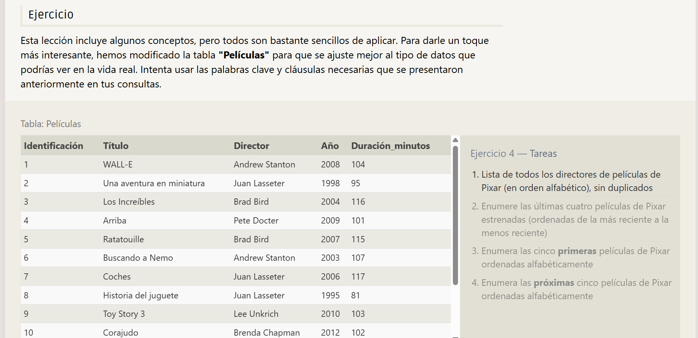
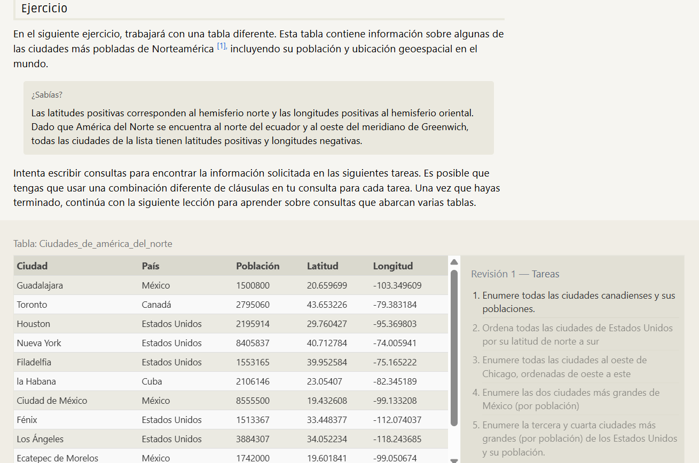
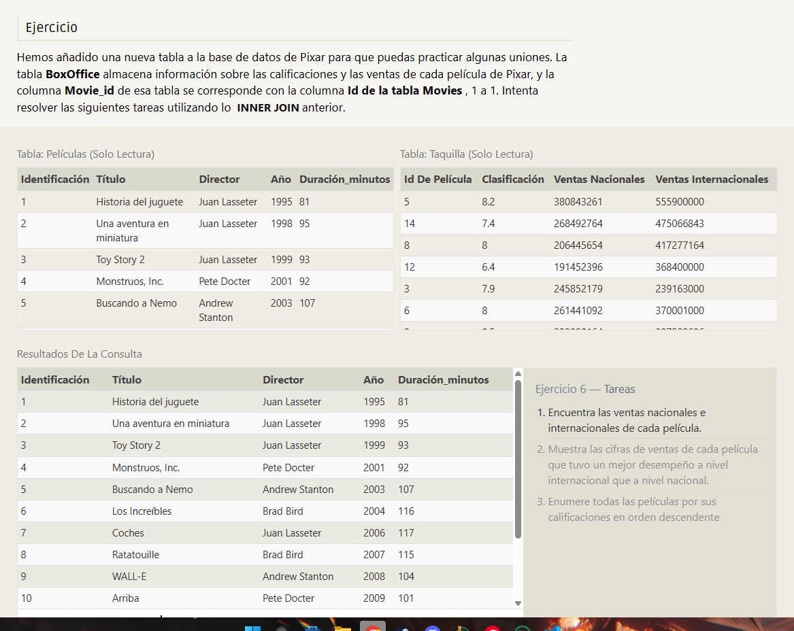
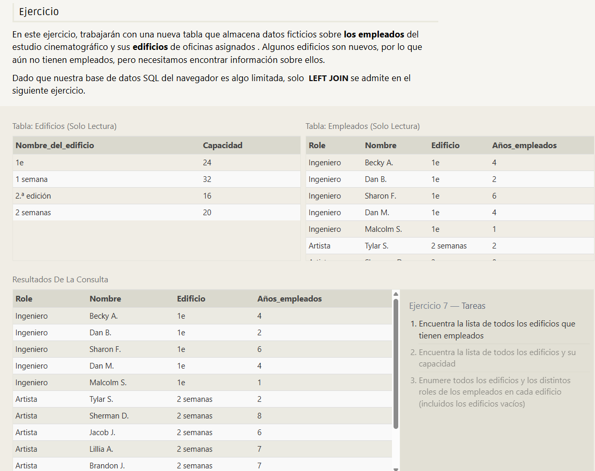

# Ejercicio 1 


## Encuentra el title de cada película 
```sql
SELECT title, FROM movies;
```
## Encuentra el director de cada película 
```sql
SELECT director, FROM movies;
```
## Encuentra el title y director de cada película
```sql
SELECT title, director FROM movies;
```

## Encuentra el title y director de cada película
```sql
SELECT title, year FROM movies;
```

## Encuentra all la información sobre cada película
 ```sql
SELECT * FROM movies;
```

----------------------------------------------------
# Ejercicio 2


## Encuentra la película con una fila id de 6
```sql
SELECT title FROM movies WHERE id = 6;
```

## Encuentra las películas estrenadas en los años 2000 y 2010
```sql
SELECT title FROM movies WHERE year BETWEEN 2000 AND 2010;
```

## Encuentra las películas no estrenadas en los años 2000 y 2010
```sql
SELECT title FROM movies WHERE year NOT BETWEEN 2000 AND 2010;
```

## Encuentra las primeras 5 películas de Pixar y su estreno 
```sql
SELECT title , year FROM movies WHERE id IN (1,2,3,4,5)
```

----------------------------------------------------
# Ejercicio 3


## Encuentra todas las películas de Toy Story
```sql
SELECT * FROM movies WHERE title LIKE "Toy Story%";
```
## Encuentra todas las películas dirigidas por John Lasseter
```sql
SELECT * FROM movies WHERE director LIKE "John Lasseter";
```
## Encuentra todas las películas (y directores) no dirigidas por John Lasseter
```sql
SELECT * FROM movies WHERE director NOT LIKE "John Lasseter";
```
## Encuentra todas las películas de WALL-*
```sql
SELECT * FROM movies WHERE title LIKE "WALL%";
```

----------------------------------------------------
# Ejercicio 4



## Lista de todos los directores de películas de Pixar (en orden alfabético), sin duplicados
```sql
SELECT DISTINCT director
FROM  movies
ORDER BY director ASC;
```

## Enumere las últimas cuatro películas de Pixar estrenadas (ordenadas de la más reciente a la menos reciente)
```sql
SELECT title, year
FROM  movies
ORDER BY year DESC
LIMIT 4;
```
## Enumera las cinco primeras películas de Pixar ordenadas alfabéticamente
```sql
SELECT title, year
FROM  movies
ORDER BY title ASC
LIMIT 5;
```
## Enumera las próximas cinco películas de Pixar ordenadas alfabéticamente
```sql
SELECT title, year
FROM  movies
ORDER BY title ASC
LIMIT 5 OFFSET 5;
```
----------------------------------------------------
# Ejercicio 5



## Enumere todas las ciudades canadienses y sus poblaciones.
```sql
SELECT city, population 
FROM north_american_cities 
WHERE country = "Canada"
```
## Ordena todas las ciudades de Estados Unidos por su latitud de norte a sur
```sql
SELECT city, latitude
FROM north_american_cities 
WHERE country = "United States"
ORDER BY latitude DESC;
```
## Enumere todas las ciudades al oeste de Chicago, ordenadas de oeste a este
```sql
SELECT city, longitude
FROM north_american_cities 
WHERE longitude < -87.629798
ORDER BY longitude ASC; 
```
## Enumere las dos ciudades más grandes de México (por población)
```sql
SELECT city, population
FROM north_american_cities 
WHERE country = "Mexico"
ORDER BY population DESC
LIMIT 2; 
```
## Enumere la tercera y cuarta ciudades más grandes (por población) de los Estados Unidos y su población.
```sql
SELECT city, population
FROM north_american_cities 
WHERE country = "United States"
ORDER BY population DESC
LIMIT 2
OFFSET 2;
```
----------------------------------------------------
# Ejercicio 6


## Encuentra las ventas nacionales e internacionales de cada película.
```sql
SELECT title, domestic_sales, international_sales
FROM boxoffice
INNER JOIN movies
ON id = movie_id    
```
## Muestra las cifras de ventas de cada película que tuvo un mejor desempeño a nivel internacional que a nivel nacional.
```sql
SELECT  title, international_sales
FROM boxoffice
INNER JOIN movies
ON boxoffice.movie_id = movies.id
WHERE international_sales > domestic_sales
```
## Enumere todas las películas por sus calificaciones en orden descendente
```sql
SELECT  title, rating
FROM movies
INNER JOIN boxoffice
ON movies.id = boxoffice.movie_id
ORDER BY rating DESC;
```

----------------------------------------------------
# Ejercicio 7   


## Encuentra la lista de todos los edificios que tienen empleados
```sql
SELECT DISTINCT building  FROM employees
```
## Encuentra la lista de todos los edificios y su capacidad
```sql
SELECT building_name, capacity FROM buildings
```
## Enumere todos los edificios y los distintos roles de los empleados en cada edificio (incluidos los edificios vacíos)
```sql
SELECT building, role 
FROM employees
JOIN LEFT buildings
ON building.employees = building_name.buildings
```