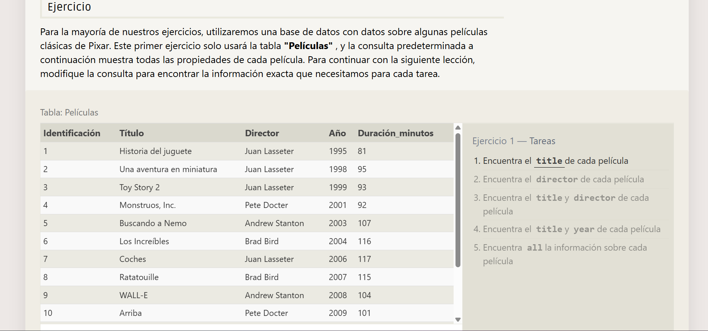
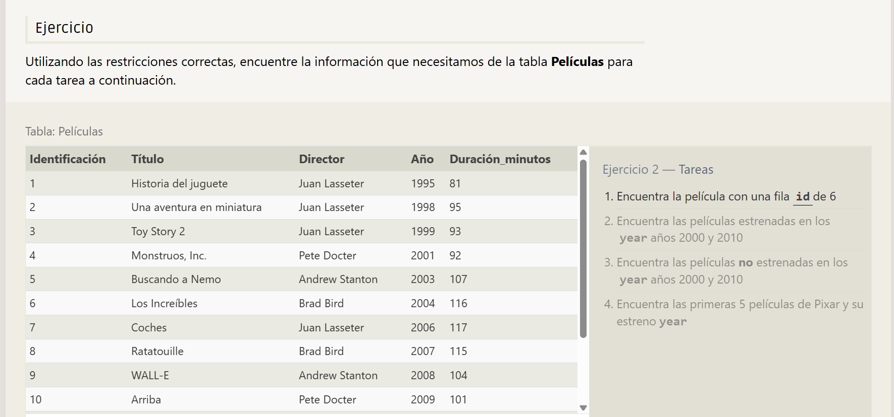
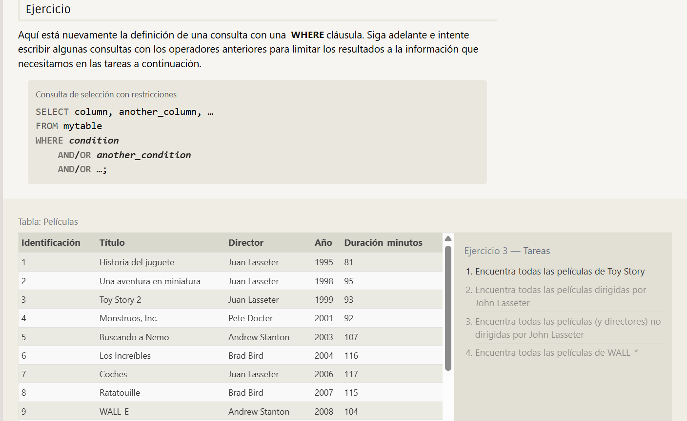

# Ejercicio 1 



## Encuentra el title de cada película 
```sql
SELECT title, FROM movies;
```
## Encuentra el director de cada película 
```sql
SELECT director, FROM movies;
```
## Encuentra el title y director de cada película
```sql
SELECT title, director FROM movies;
```

## Encuentra el title y director de cada película
```sql
SELECT title, year FROM movies;
```

## Encuentra all la información sobre cada película
 ```sql
SELECT * FROM movies;
```

----------------------------------------------------
# Ejercicio 2




## Encuentra la película con una fila id de 6
```sql
SELECT title FROM movies WHERE id = 6;
```

## Encuentra las películas estrenadas en los años 2000 y 2010
```sql
SELECT title FROM movies WHERE year BETWEEN 2000 AND 2010;
```

## Encuentra las películas no estrenadas en los años 2000 y 2010
```sql
SELECT title FROM movies WHERE year NOT BETWEEN 2000 AND 2010;
```

## Encuentra las primeras 5 películas de Pixar y su estreno 
```sql
SELECT title , year FROM movies WHERE id IN (1,2,3,4,5)
```

----------------------------------------------------
# Ejercicio 3



## Encuentra todas las películas de Toy Story
```sql
SELECT * FROM movies WHERE title LIKE "Toy Story%";
```
## Encuentra todas las películas dirigidas por John Lasseter
```sql
SELECT * FROM movies WHERE director LIKE "John Lasseter";
```
## Encuentra todas las películas (y directores) no dirigidas por John Lasseter
```sql
SELECT * FROM movies WHERE director NOT LIKE "John Lasseter";
```
## Encuentra todas las películas de WALL-*
```sql
SELECT * FROM movies WHERE title LIKE "WALL%";
```

----------------------------------------------------
# Ejercicio 4