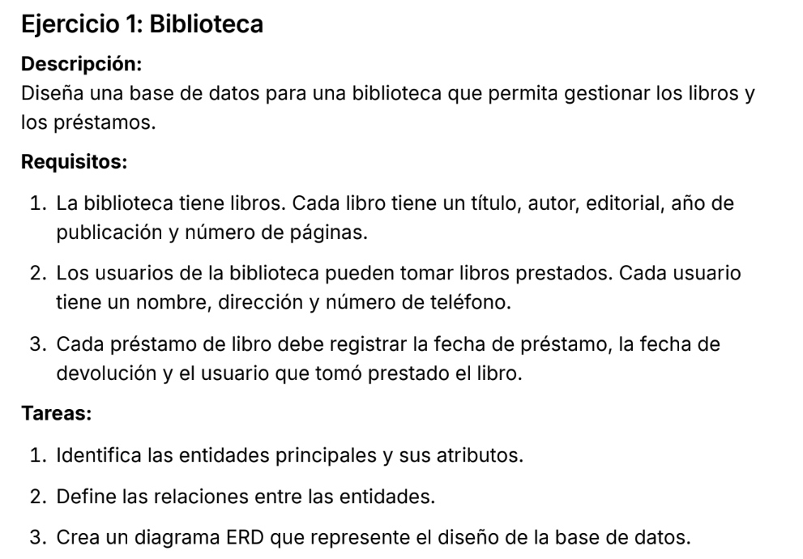
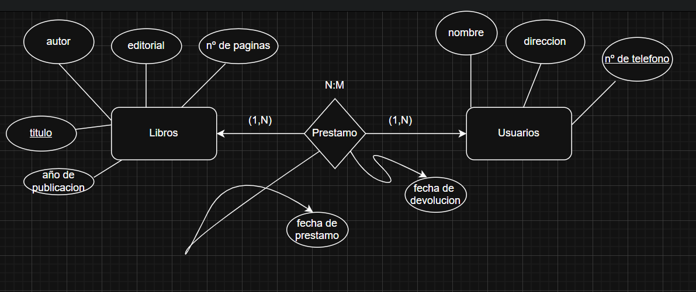
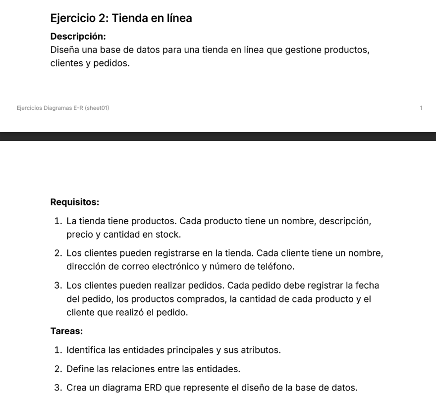
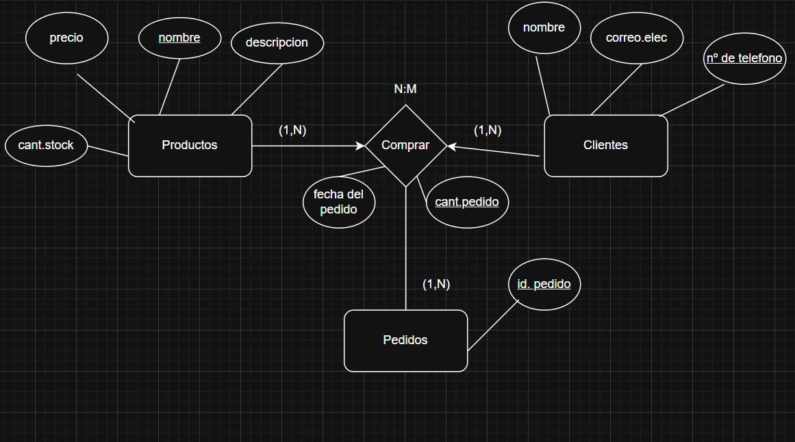
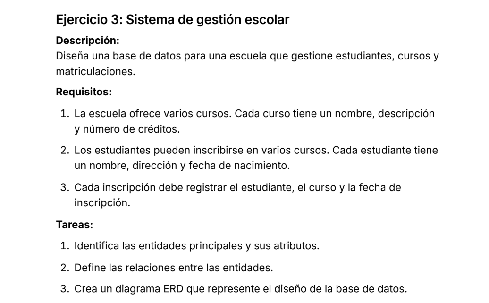
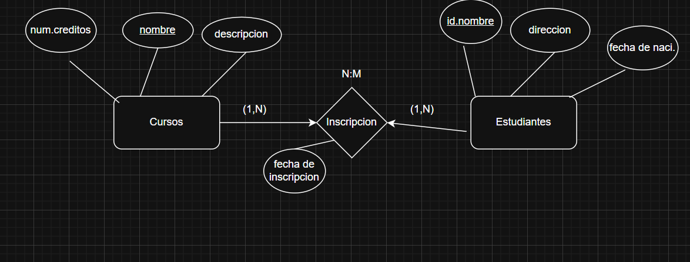
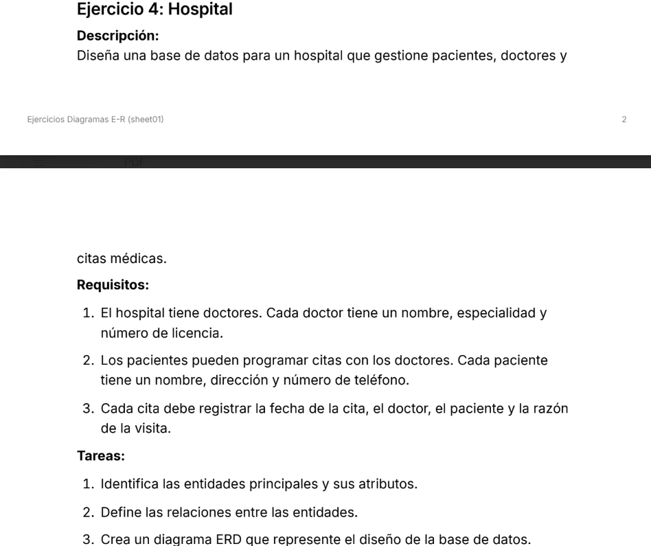
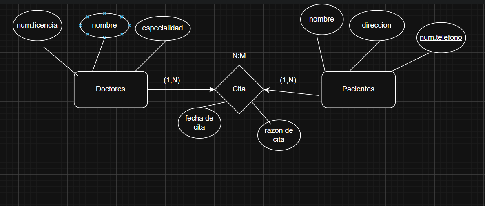
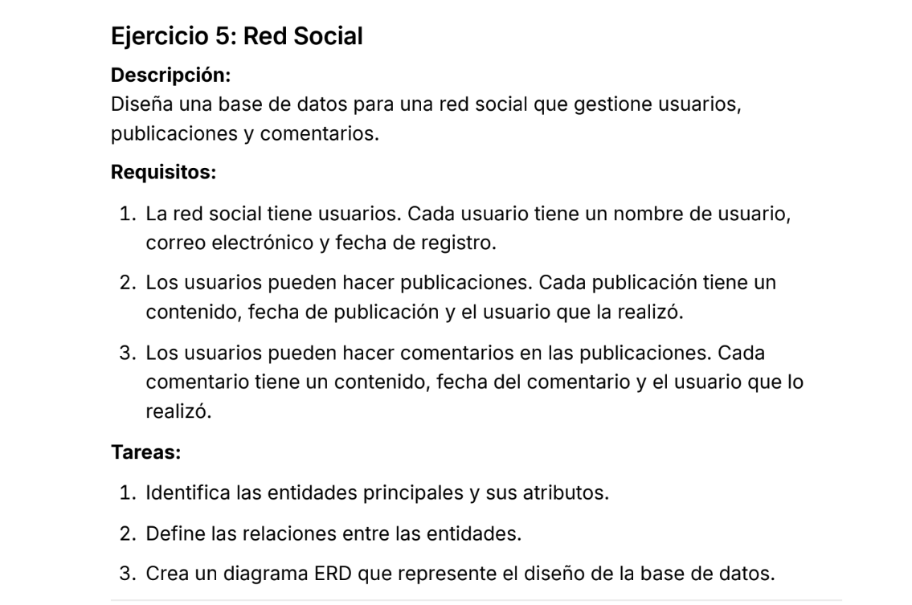
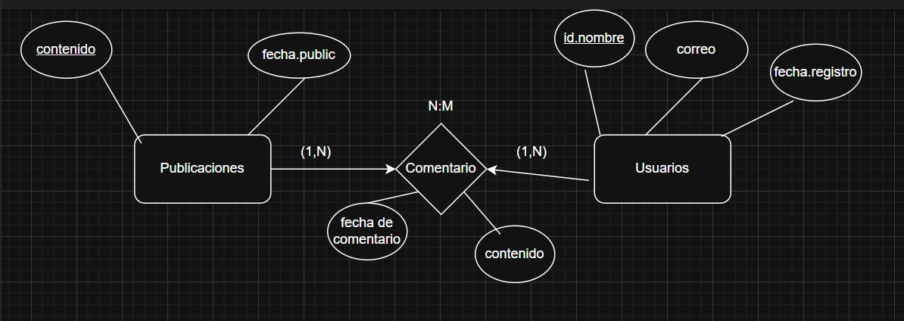

# Ejercicio 1: Biblioteca

## Grafico de la base de datos:

----------------------------------------------------

# Ejercicio 2: Tienda en linea

## Grafico de la base de datos:

----------------------------------------------------

# Ejercicio 3: Sistema de gestion escolar

## Grafico de la base de datos:

----------------------------------------------------

# Ejercicio 4: Hospital

## Grafico de la base de datos:

----------------------------------------------------

# Ejercicio 5: Red Social

## Grafico de la base de datos:

