# Ejercicio 1
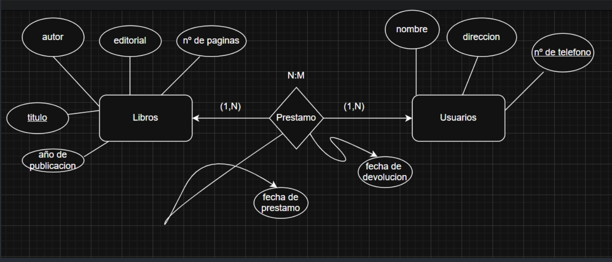

## Diagrama: 
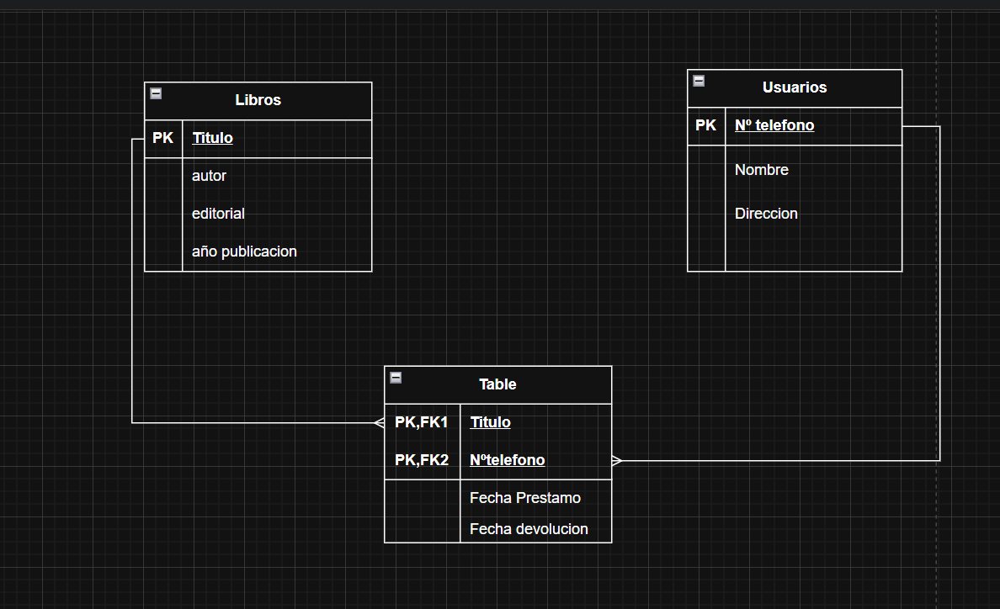

## Modo texto:
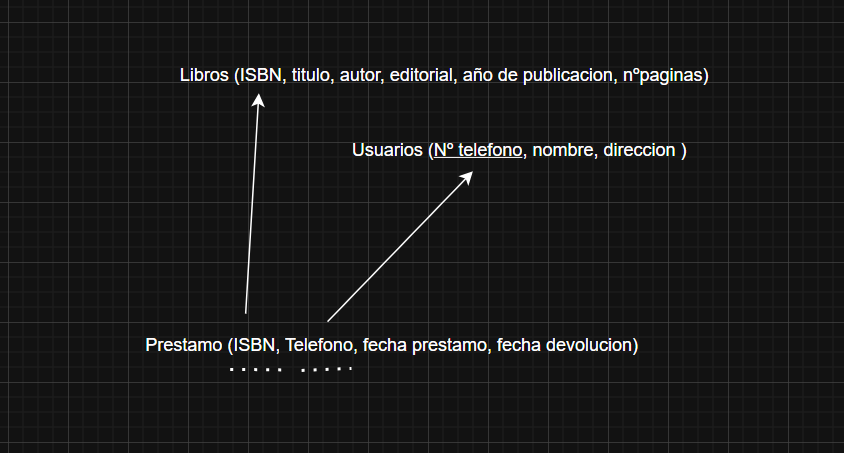

----------------------------------------------------
# Ejercicio 2
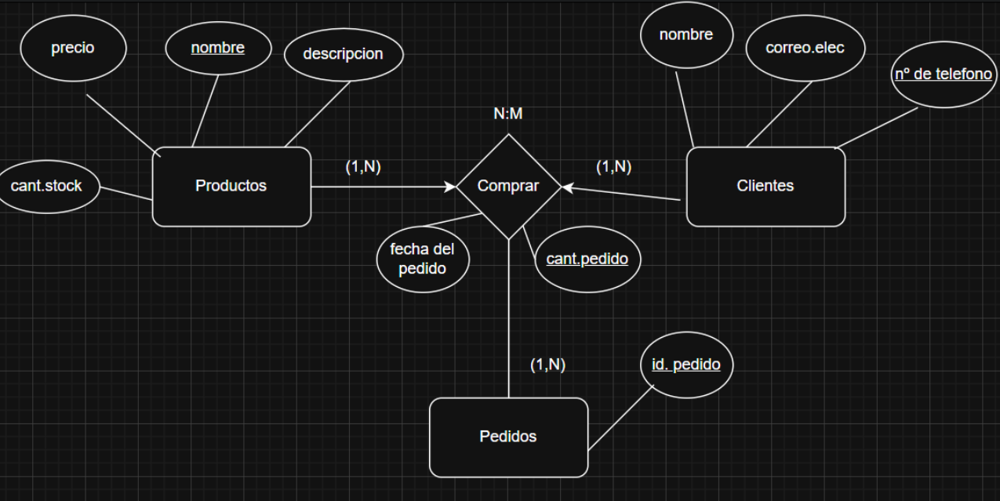

## Diagrama: 
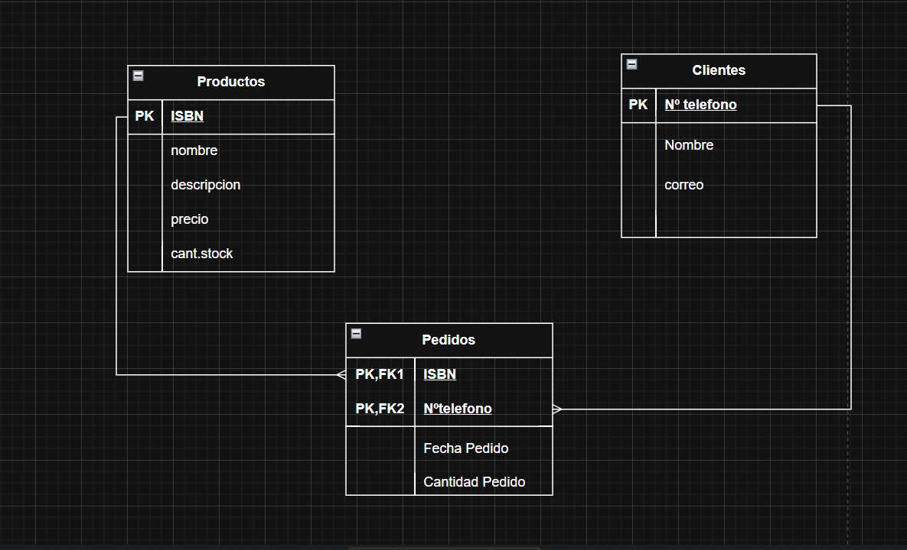

## Modo texto:
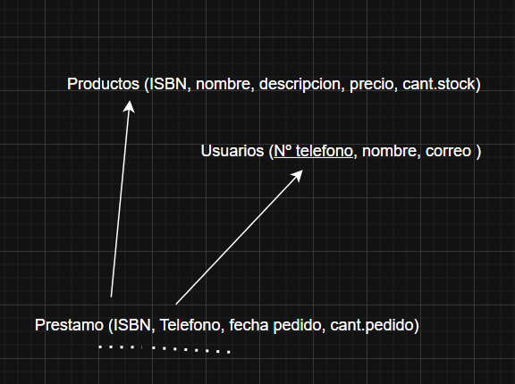

----------------------------------------------------

# Ejercicio 3
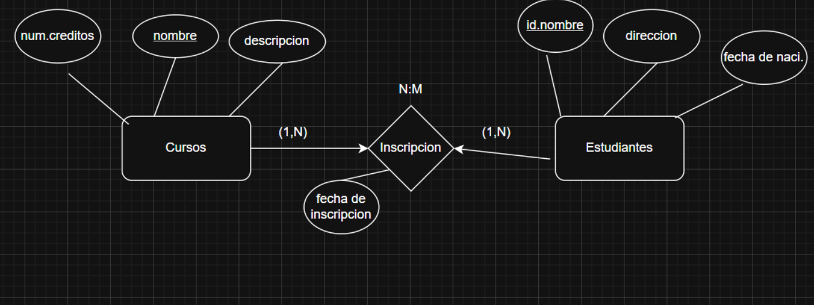

## Diagrama: 

## Modo texto:
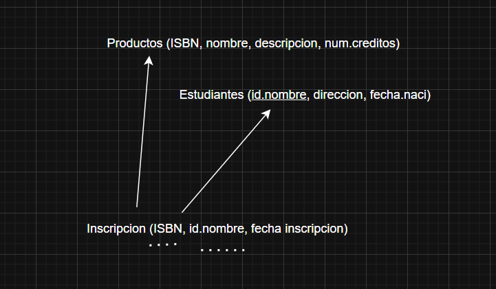

----------------------------------------------------
# Ejercicio 4
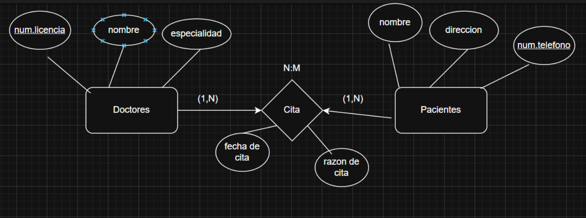

## Diagrama: 
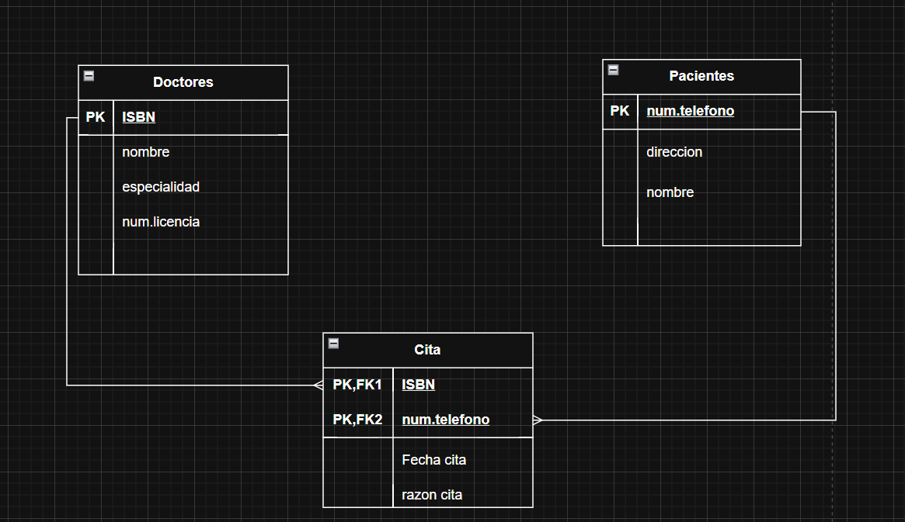

## Modo texto:
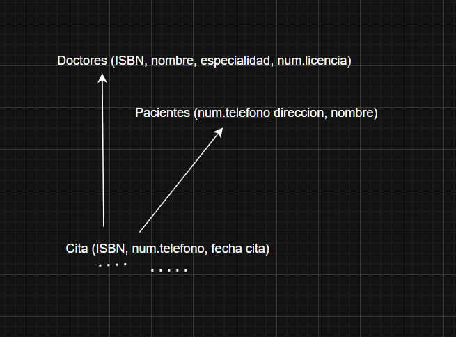

----------------------------------------------------

# Ejercicio 5

## Diagrama: 

## Modo texto:
